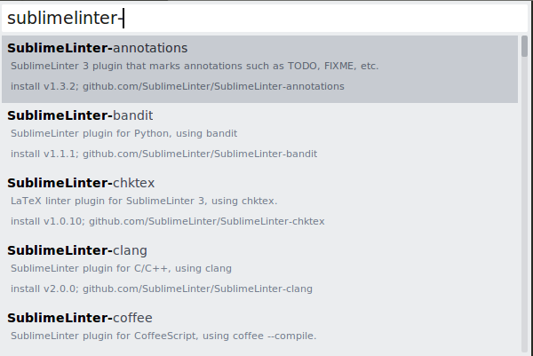

#BÁO CÁO CHUẨN BỊ 1
##1. Skype
Acount: tzmmmm@outlook.com

Nickname: Hồ Anh Tiến – Digital Content -  TTS – IT
(Đã được thêm vào nhóm).
##2. Gmail
Acount: tien98qb@gmail.com
##3. Github
Acount: https://github.com/komatsu98
##4. Gitlab
Acount: https://gitlab.com/tienha98
##5. JsFidle
Link: https://jsfiddle.net/tienha98/01u5jx27/4/
##6. StackOverflow
Acount: https://stackoverflow.com/users/10085949/tien-ho

Câu hỏi: https://stackoverflow.com/questions/51354079/how-to-upload-a-file-on-gitlab
##7. Codepen
Acount: https://codepen.io/tienha98/

Demo: https://codepen.io/tienha98/pen/ZMexyq
##8. CodeSchool
null
##9. Sublime text
Install package:

Demo: package SublimeLinter-jshint:

##10.  Quora
Acount: https://www.quora.com/profile/Tien-Ho-7
Các topic đã follow: https://www.quora.com/profile/Tien-Ho-7/topics

##11.  PHPStorm
Chỉnh các thông số về indent: 
File > Settings > Editor > Code Style > PHP

Cài đặt shortcut key:
File > Settings > Keymap

Plugin Laravel đã được cài đặt:
File > Settings > Plugins > Laravel Plugin

##12.  Xem qua một số kế hoạch cũ
Đã xem.
##13.  Github page
Link: https://komatsu98.github.io/
